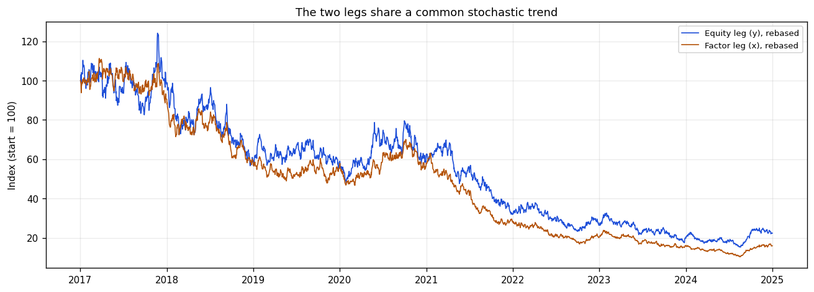
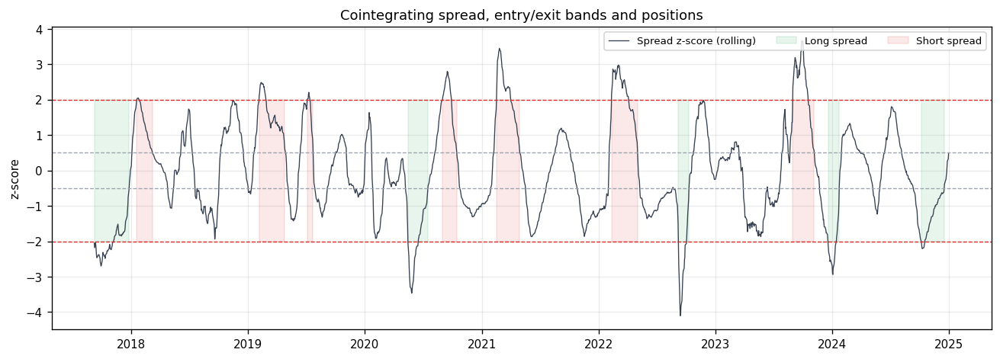
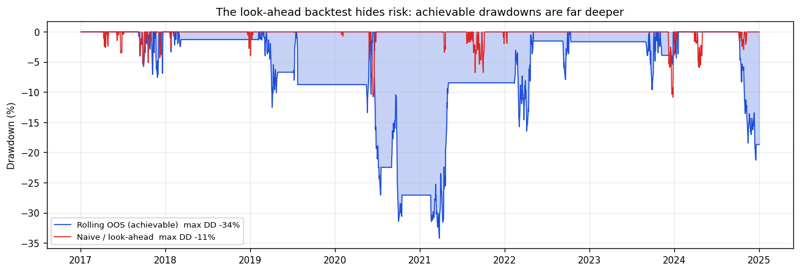
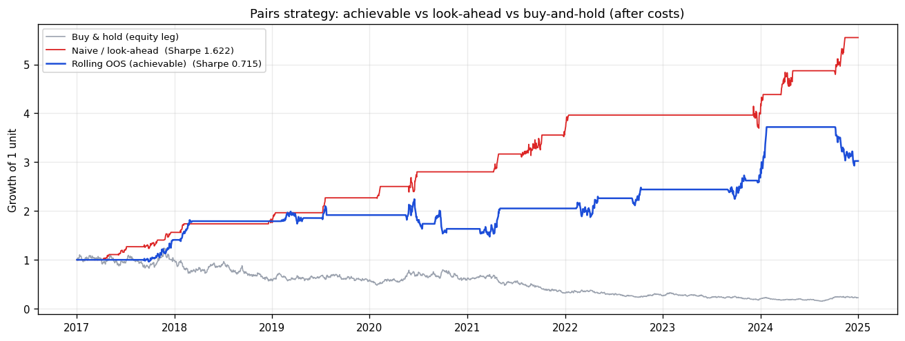

# energy-pairs-trading

Cointegration-based statistical arbitrage on an energy pair, with an honest backtest.

This project tests whether an oil-sector equity and a crude factor move together closely enough to trade the gap between them, builds a mean-reversion strategy on the cointegrating spread, and backtests it the way it has to be done to mean anything: hedge ratio and z-score estimated on past data only, transaction costs charged, and results benchmarked against the same strategy run with look-ahead so the inflation is visible. It runs end to end on a synthetic cointegrated pair with known properties, and switches to real tickers (ExxonMobil, Chevron, crude) with one argument.

## What it upgrades

It is the rigorous version of a common beginner project: regress an oil equity on the crude price, note the high R-squared, declare a relationship. That regression is a [spurious-regression](https://en.wikipedia.org/wiki/Spurious_relationship) trap — two independent random walks produce a high R-squared and a significant t-stat purely because both trend. The fix is the standard cointegration workflow, and a pairs strategy that is only valid if the two series genuinely cointegrate.

## The workflow

1. **Stationarity.** ADF-test each log price. Both legs are non-stationary (I(1)); regressing one level on the other is invalid.
2. **Cointegration.** Test whether a linear combination is stationary, two ways: Engle-Granger (regress, then ADF the residual) and Johansen (a system test that returns the cointegrating rank and does not depend on which series is the regressand).
3. **Half-life.** Fit the spread's mean reversion as an Ornstein-Uhlenbeck process and read off the half-life — the horizon you can actually trade.
4. **Strategy.** Trade the spread as a z-score: enter past ±2σ, exit near zero, with the hedge ratio and the z-score normalisation estimated on a trailing window (past data only).
5. **Honest backtest.** Run the same strategy with full-sample (look-ahead) parameters and compare. The gap is the look-ahead premium that flatters most published-looking pairs results.

## Key results (on the bundled synthetic pair)

`python run_analysis.py` reproduces these exactly (seed fixed).

**The econometrics recover the truth.** The two legs test non-stationary (ADF p ≈ 0.76 and 0.84), the pair cointegrates (Engle-Granger p < 0.001; Johansen rank 1, the correct answer for one cointegrating relationship), and the spread's half-life comes out at **17.7 days**, matching the 18-day mean reversion built into the generator.



**The spread is the tradable object.** Normalised to a z-score, it oscillates around zero and reverts; the strategy goes short when it is rich (above +2) and long when it is cheap (below −2), closing as it reverts.



**Look-ahead more than doubles the Sharpe.** The achievable rolling strategy earns a Sharpe of about **0.72** after costs. The same logic with a full-sample hedge ratio and z-score — which quietly uses information from the future — reports **1.62**, a **2.3× inflation**. A single pair at Sharpe 0.7 is realistic; 1.6 is an artefact.



**And the look-ahead version hides the risk.** Its worst drawdown is about −11%; the strategy you could actually have traded draws down to roughly −34%. A backtest that normalises on the full sample doesn't just overstate return, it understates how bad the bad periods are.



The strategy is also close to market-neutral: it makes money in the synthetic sample while the equity leg itself drifts lower, because it trades the relationship rather than the direction.

## How the rigor is enforced

- **No look-ahead.** The hedge ratio and the z-score mean/standard deviation are estimated on a trailing window; the position decided on day *t* is applied to day *t+1*. `tests/test_pairs.py` proves it: perturbing the series after a cut date leaves every earlier position unchanged. The naive full-sample signal deliberately fails the same test — that contrast is the point.
- **Levels are never regressed directly.** All work is in logs, and cointegration is established before any trading logic, so the spurious-regression trap is closed.
- **Costs and turnover are real.** Every position change is charged a per-leg transaction cost, and the summary reports turnover, hit rate and time-in-market alongside the Sharpe.
- **Two independent cointegration tests.** Engle-Granger and Johansen are reported together; agreement between them is more convincing than either alone.

## Repository structure

```
energy-pairs-trading/
├── README.md
├── requirements.txt
├── run_analysis.py            # end-to-end pipeline; writes figures to outputs/
├── src/
│   ├── data.py                # synthetic cointegrated pair + optional yfinance loader
│   ├── cointegration.py       # ADF, Engle-Granger, Johansen, hedge ratio, half-life
│   └── pairs.py               # rolling OOS signal, naive look-ahead signal, costed backtest
├── notebooks/
│   └── pairs_trading_analysis.ipynb   # narrative walkthrough
├── tests/
│   └── test_pairs.py          # cointegration recovery + no-look-ahead proof
├── data/README.md             # data provenance and real-data instructions
└── outputs/                   # generated figures
```

## Quickstart

```bash
python -m venv .venv && source .venv/bin/activate   # optional
pip install -r requirements.txt

python run_analysis.py        # full pipeline on synthetic data, writes outputs/
pytest -q                     # cointegration + no-look-ahead tests
```

Each module also runs standalone (`python -m src.cointegration`, etc.) and prints a self-check.

## Using real data

```python
from src.data import get_pair_data
df = get_pair_data(source="yahoo", ticker_y="XOM", ticker_x="CVX")
```

Nothing downstream changes. See `data/README.md` for pair selection and the practical caveats.

## Honest caveats

The bundled data is synthetic, with cointegration and a known half-life built in, so the headline numbers describe that process, not the real market. Its job is to show the methodology recovers what is actually there and to let the repo run anywhere. On real pairs, expect lower and less stable performance: cointegration can break down out of sample, a single pair is fragile, and any serious version trades a diversified basket and accounts for borrow costs and the multiple-testing problem that comes from screening many candidate pairs.

## Methods and references

- Engle, R., & Granger, C. (1987). Co-integration and error correction. *Econometrica*.
- Johansen, S. (1991). Estimation and hypothesis testing of cointegration vectors. *Econometrica*.
- Gatev, E., Goetzmann, W., & Rouwenhorst, K. (2006). Pairs trading: performance of a relative-value arbitrage rule. *Review of Financial Studies*.
- Vidyamurthy, G. (2004). *Pairs Trading: Quantitative Methods and Analysis*.

Built with statsmodels, pandas, scipy, and matplotlib.
